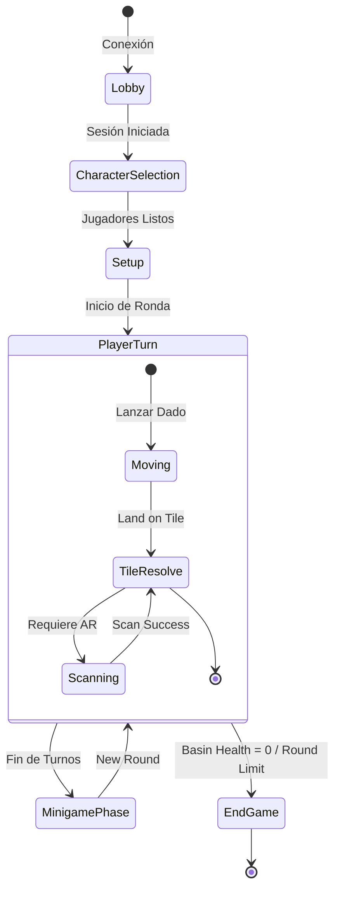
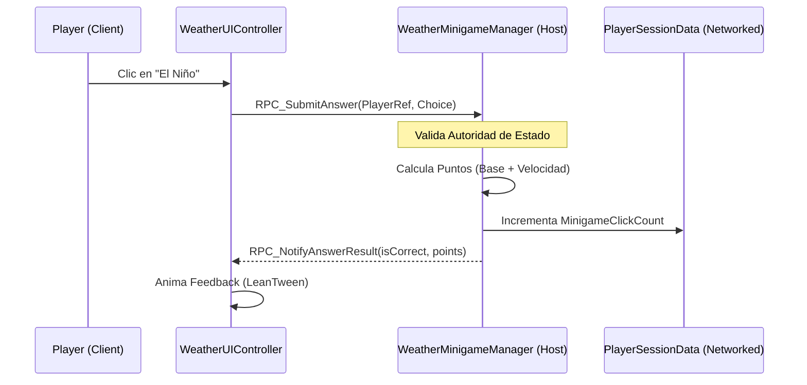
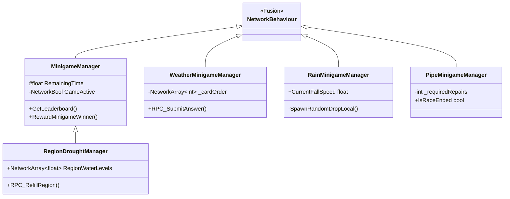
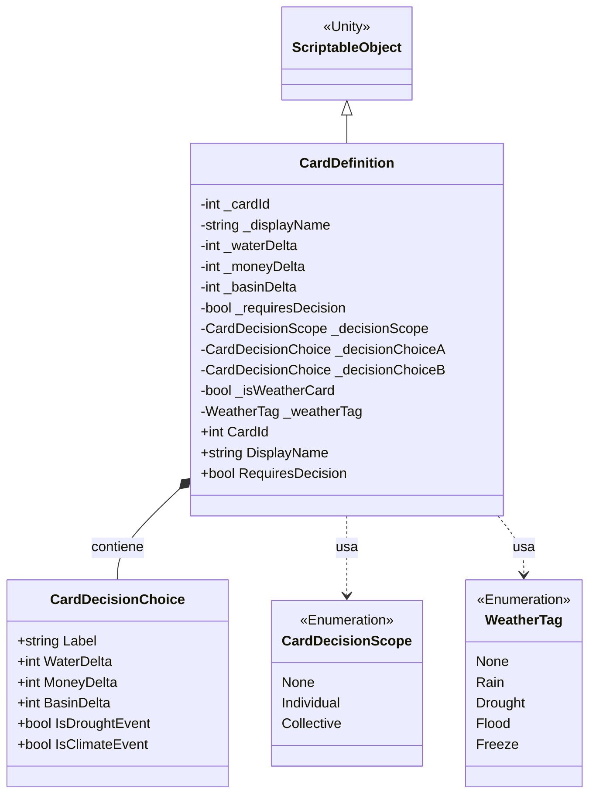
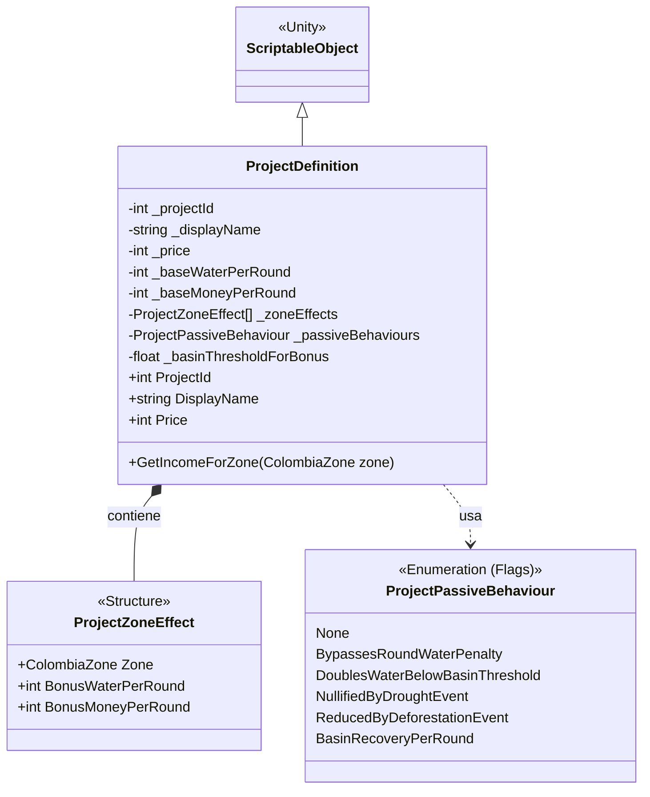

# Especificación de Arquitectura de Software: Sumapp Final

Este documento presenta un análisis exhaustivo de la arquitectura técnica del proyecto **Sumapp Final**, diseñado bajo estándares de ingeniería de software para sistemas interactivos multijugador en tiempo real con Realidad Aumentada (AR).

---

## 1. Resumen Arquitectónico
El sistema adopta una arquitectura basada en **Servicios y Autoridad de Estado (State-Authority)**, utilizando el motor **Unity 6** y el framework de networking **Photon Fusion**. La estructura se divide en capas de lógica de red, gestión de estado de juego, interacción de realidad aumentada y presentación de interfaz de usuario.

### 1.1. Diagrama de Componentes del Sistema
Este diagrama ilustra la organización de alto nivel y las dependencias entre los módulos principales.

```mermaid
componentDiagram
    component [Photon Fusion Engine] as Fusion
    component [Vuforia Engine] as AR
    component [Game Manager] as Core
    component [Player Session Data] as Data
    component [UI System] as UI
    component [ScriptableObject Databases] as DB

    Core --> Fusion : State Authority
    Core --> DB : Configuration
    Data --> Fusion : Networked Properties
    UI ..> Data : Observes (Events)
    AR --> Core : Triggers Scans
    UI --> Core : Sends RPCs
```

---

## 2. Modelos de Datos y Estado de Red
El núcleo del juego reside en el modelo de **State-Authority (Host-Client)**. A diferencia de los modelos tradicionales de cliente-servidor, Photon Fusion permite que el "Host" mantenga la autoridad total sobre el estado simulado, mientras que los clientes predicen localmente sus movimientos.

### 2.1. PlayerSessionData: El Átomo de Estado
Cada jugador posee un objeto `PlayerSessionData`. Este componente es un `NetworkBehaviour` que centraliza los recursos individuales (Agua, Dinero, Posición) y el estado de sincronización.

*   **Importancia Arquitectónica:** Garantiza que el estado de cada usuario persista a través de los cambios de escena (ej. de la escena de tablero al minijuego) sin pérdida de datos.
*   **Acoplamiento y Cohesión:** Presenta una alta cohesión al encapsular exclusivamente los atributos del jugador, y un bajo acoplamiento mediante el uso de propiedades `[Networked]` que el sistema de UI observa de forma reactiva.

---

## 3. Máquina de Estados de Juego (GameManager)
El `GameManager` actúa como el orquestador central del ciclo de vida de la partida. Implementa una máquina de estados para gestionar la secuencia de turnos y las fases globales.

### 3.1. Diagrama de Estados del Ciclo de Vida


*   **Escalabilidad:** El uso de un sistema de resolución de casillas (`TileService`) permite añadir nuevos tipos de terrenos o efectos simplemente extendiendo el `BoardTileConfig` (ScriptableObject), cumpliendo con el principio de **Abierto/Cerrado**.

---

## 4. Sistema de Interacción AR (Vuforia Integration)
El proyecto utiliza un puente entre los eventos de rastreo de Vuforia y la lógica de red.

*   **Propósito:** Validar acciones físicas del jugador (como jugar una carta de proyecto o responder a un evento climático) dentro del entorno digital sincronizado.
*   **Responsabilidades:**
    1.  Detección de `ImageTargets`.
    2.  Filtrado por tiempo de enfriamiento (`_scanCooldownSeconds`) para evitar dobles escaneos.
    3.  Envío de peticiones via `RPC` al `GameManager` para validar si el jugador activo tiene permiso para escanear.

---

## 5. Diseño Basado en Datos (Data-Driven Design)
Gran parte de la lógica no está escrita en código duro (hardcoded), sino definida en **ScriptableObjects**.

| Sistema | Clase de Datos | Responsabilidad |
| :--- | :--- | :--- |
| **Recursos** | `CardDefinition` | Define deltas de agua/dinero y efectos de clima. |
| **Construcción** | `ProjectDefinition` | Define costes por zona y beneficios pasivos. |
| **Trivia** | `TriviaDatabase` | Almacena preguntas, respuestas y aleatoriedad. |

*   **Ventaja Técnica:** Esto desacopla la lógica de ejecución de los datos de balance, permitiendo a los diseñadores modificar el juego sin necesidad de recompilar el código.

---

## 6. Sistema de Comunicación y Eventos
Para mantener la UI desacoplada del sistema de red, se implementó un sistema de **Eventos de Fusión (FusionEvents)**.

### 6.1. Diagrama de Secuencia: Resolución de Respuesta en Minijuego
Este diagrama muestra cómo una acción del jugador fluye a través de la arquitectura.



---

## 7. Análisis de Ingeniería

### 7.1. Escalabilidad
La arquitectura es altamente escalable en tres dimensiones:
1.  **Contenido:** Añadir cartas o proyectos no requiere cambios en los scripts base.
2.  **Jugadores:** El sistema de red está optimizado para el modelo Host-Client de Fusion, soportando dinámicamente el crecimiento de la lista de jugadores.
3.  **Miniguegos:** Los miniguegos son escenas independientes que solo requieren heredar de un `MinigameManager` base para integrarse en el flujo global.

### 7.2. Modularidad y Cohesión
*   **Servicios:** Lógicas específicas como el `BasinService` (Gestión de la Cuenca) o `TileService` están aisladas, lo que facilita el mantenimiento y las pruebas unitarias.
*   **UI Decoupling:** Los controladores de UI no saben *cómo* se calcula el puntaje; solo reaccionan a cambios en las propiedades `[Networked]` o eventos de red, reduciendo el riesgo de errores de sincronización visual.

### 7.3. Persistencia
Se utiliza un patrón de **Gestión de Sesión Persistente**. Los objetos `GameManager` y `PlayerSessionData` marcados con `DontDestroyOnLoad` actúan como el repositorio de estado a largo plazo, mientras que las escenas de minijuegos son "estateless" (sin estado), cargando y descargando sus lógicas locales en cada ronda.

---

## 9. Ecosistema de Minijuegos
El proyecto implementa una fase competitiva y colaborativa mediante minijuegos independientes que se activan al finalizar las rondas del tablero. Esta sección detalla la arquitectura de los diversos retos implementados.

### 9.1. Jerarquía de Controladores de Minijuegos
Para maximizar la reutilización de código, el sistema emplea una estructura de herencia y composición.



### 9.2. Análisis Técnico por Minijuego

#### A. Minijuego de Clima (Weather Minigame)
*   **Propósito:** Educación sobre los fenómenos de "El Niño" y "La Niña".
*   **Mecánica:** Los jugadores deben identificar correctamente el fenómeno basado en una descripción e ilustración aleatoria.
*   **Autoridad de Red:** El Host genera un orden aleatorio sincronizado (`NetworkArray`) para asegurar que todos los clientes enfrenten el mismo reto simultáneamente.
*   **Puntuación:** Basada en acierto y velocidad de respuesta.

#### B. Minijuego de Lluvia (Rain Minigame)
*   **Propósito:** Recolección de recursos hídricos evadiendo contaminantes.
*   **Mecánica:** Juego de estilo "dodger/collector" donde caen gotas con diferentes valores.
*   **Arquitectura:** Utiliza un sistema de *Spawning* local sincronizado por tiempo global de red. La velocidad de caída escala linealmente con el tiempo para aumentar la dificultad (Difficulty Scaling).
*   **Componente Crítico:** `RainDrop.cs` gestiona la detección de colisiones 2D y el reporte de puntos al Host mediante RPCs.

#### C. Reparación de Tuberías (Pipe Race)
*   **Propósito:** Competencia por recursos económicos (Moneda).
*   **Mecánica:** Carrera de clics donde el primer jugador en alcanzar el límite de reparaciones (`_requiredRepairs`) gana el premio mayor.
*   **Responsabilidades:** El `PipeMinigameManager` monitorea constantemente los contadores de clics sincronizados en el `PlayerSessionData` de todos los participantes.

#### D. Emergencia por Sequía (Region Drought)
*   **Propósito:** Gestión de recursos a gran escala y priorización.
*   **Mecánica:** Los niveles de agua de 6 regiones disminuyen constantemente. Los jugadores deben "clicar" en las regiones para rellenarlas.
*   **Arquitectura:** Implementa un sistema de "Región en Emergencia" con multiplicadores de puntos, fomentando la toma de decisiones rápida.
*   **Escalabilidad:** Hereda de `MinigameManager`, reutilizando toda la lógica de temporizadores y visualización de líderes.

---

## 11. Sistema de Cartas y Definición de Datos
El juego utiliza un enfoque **Data-Driven** para definir el comportamiento de los elementos interactivos del tablero, separando la lógica de ejecución de la configuración de balance mediante el uso extensivo de `ScriptableObjects`.

### 11.1. Cartas de Evento (CardDefinition)
Este sistema gestiona las cartas que los jugadores escanean en el tablero. Pueden desencadenar efectos inmediatos, decisiones colectivas o alterar el clima global.



### 11.2. Cartas de Proyecto (ProjectDefinition)
Define los proyectos que los jugadores pueden construir. Los ingresos pasivos dependen de la zona geográfica y el estado de salud de la cuenca hídrica.



---

## 12. Conclusión Final de la Arquitectura
La integración de estos subsistemas bajo un marco común de networking y persistencia permite que **Sumapp Final** sea más que un juego de tablero; es una plataforma modular de aprendizaje y competencia. La separación clara entre la lógica de autoridad (Host) y la representación visual (Clientes) garantiza una experiencia multijugador fluida y técnicamente robusta para el entorno académico y multimedia.
