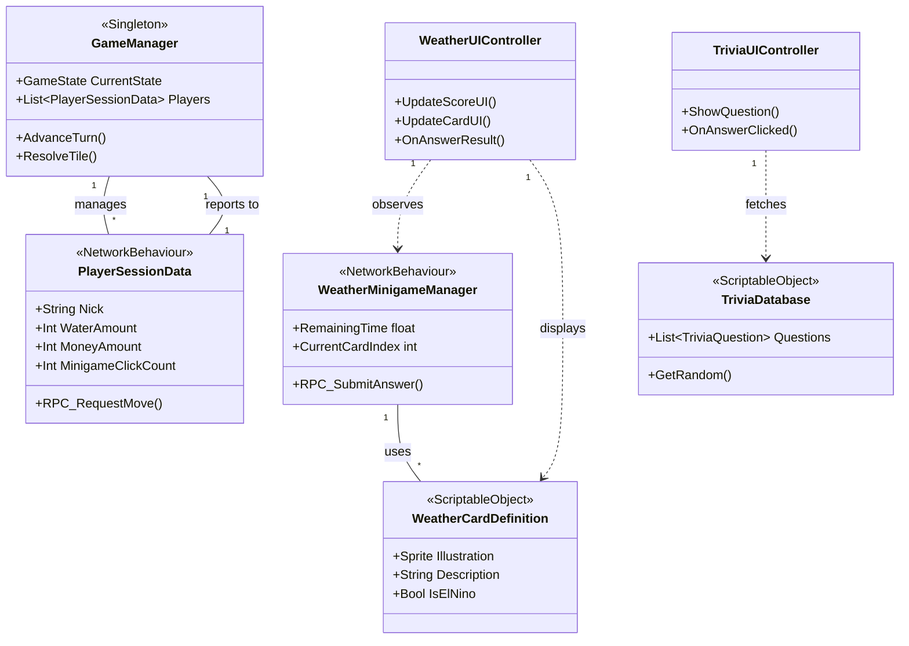

# Diagrama UML del Proyecto

Este archivo contiene la representación visual de las relaciones entre las clases principales utilizando sintaxis de **Mermaid**.

## Instrucciones de Visualización
Puedes visualizar este diagrama directamente en:
1. **GitHub/GitLab:** Renderizan automáticamente los bloques de código `mermaid`.
2. **VS Code:** Con la extensión "Markdown Preview Mermaid Support".
3. **Mermaid Live Editor:** Copia el código en [mermaid.live](https://mermaid.live/).
